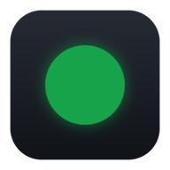

<div align="center">



# GCloud Dot

**Know before your gcloud session expires, not after your next command fails.**

[](https://github.com/nicglazkov/gcloud-dot/actions/workflows/ci.yml)
[](https://github.com/nicglazkov/gcloud-dot/releases/latest)
[](https://github.com/nicglazkov/gcloud-dot/releases)
[](https://nicglazkov.github.io/gcloud-dot/security.html)
[](LICENSE)

[**Website**](https://nicglazkov.github.io/gcloud-dot/) &nbsp;|&nbsp;
[**Download**](https://github.com/nicglazkov/gcloud-dot/releases/latest) &nbsp;|&nbsp;
[**How it works**](https://nicglazkov.github.io/gcloud-dot/#how) &nbsp;|&nbsp;
[**Privacy**](https://nicglazkov.github.io/gcloud-dot/privacy.html) &nbsp;|&nbsp;
[**Security**](https://nicglazkov.github.io/gcloud-dot/security.html)

</div>

<br>

Google enforces a reauth session on `gcloud`, sixteen hours by default, and
tells your machine nothing about it. There is no deadline to read, no warning,
and no indicator. You find out when a command fails, usually in the middle of
something else.

GCloud Dot puts one dot in your menu bar or system tray. It reports whether your
credentials are alive, and roughly how long they have left.

<br>

<div align="center">
&nbsp;&nbsp;
&nbsp;&nbsp;
&nbsp;&nbsp;
&nbsp;&nbsp;

</div>

<br>

## The one idea

It reports **two different things** and never lets you confuse them.

**Whether you are signed in is measured.** Every ten minutes it runs
`gcloud auth print-access-token`. A token means alive. An `invalid_grant` or a
reauth error means gone. Anything else (a timeout, a captive portal) is
reported as *unknown* and leaves the previous verdict standing. A dropped
network never turns the dot red, because a dot that cries wolf is a dot you stop
believing.

**How long you have left is predicted,** and every place it appears says so.
Google does not publish the session deadline to the client, so the only way to
learn it is to watch a session end. GCloud Dot does exactly that: when it
catches a valid → expired transition, it records the length. After three
observations the countdown is the median of them; before that it falls back to
the gaps between your past logins, and tells you it is doing so.

On the machine this was developed against, eighteen observed sessions landed
between **15.91h** and **16.08h**, converging, without being told, on Google's
documented sixteen-hour default.

<br>

## Install

**macOS**

```sh
brew install --cask nicglazkov/tap/gcloud-dot
```

Or download [`GCloud-Dot.dmg`](https://github.com/nicglazkov/gcloud-dot/releases/latest)
and drag it to Applications. Signed with a Developer ID certificate and
notarized by Apple, with the ticket stapled to both the app and the disk image,
so it opens on the first double click even offline.

**Windows**

```powershell
irm https://raw.githubusercontent.com/nicglazkov/gcloud-dot/main/install/install.ps1 | iex
```

Or run the installer from the releases page. It installs per user and never asks
for administrator rights. It is not code-signed yet, so SmartScreen shows
*"Windows protected your PC"*, click **More info**, then **Run anyway**.

**Linux**

```sh
curl -fsSL https://raw.githubusercontent.com/nicglazkov/gcloud-dot/main/install/install.sh | sh
```

Or use the `.deb`, the `.AppImage`, or `yay -S gcloud-dot`. On a headless server,
add `--no-gui` to install only the command.

> **GNOME needs an extension.** GNOME has shipped no system tray since 3.26, so
> without [AppIndicator support](https://extensions.gnome.org/extension/615/appindicator-support/)
> the dot has nowhere to appear. GCloud Dot detects this at startup and says so
> rather than starting invisibly.

<br>

## What it shows

|   |   |
|---|---|
| ⏱ **A live countdown** | Drawn into the icon on Windows and Linux; beside it in the macOS menu bar, where there is a text slot for it |
| 🔴 **Measured expiry** | Red means a real command came back refusing the credential. Never a guess, never a network blip |
| 🧠 **A learned session length** | Which gets more accurate the longer you run it, and always reports how much evidence is behind it |
| 🔑 **Application default credentials** | Tracked separately, because they expire on their own schedule and are the reason "gcloud works but my code doesn't" |
| 🗂 **Account, project, and configuration** | With a switcher, so changing configuration does not need a terminal |
| 🔔 **Warnings you can tune** | Two hours and thirty minutes by default, with quiet hours, and never an action taken without you |
| 🖥 **A real command** | `gcloud-dot status --json` for prompts, scripts, and machines with no desktop at all |
| 🔒 **No permissions, no telemetry** | Nothing to grant on any platform. No account, no server, nothing sent anywhere |

<br>

## The command

```console
$ gcloud-dot
🟢 signed in, about 14h 12m left (measured, n=18)
  account       nic@glazkov.com
  project       my-project
  configuration default
  last login    Fri Aug 8, 06:31 (2h ago)
  est. expiry   Fri 22:33, 14h 12m left
  session       16.1h (measured, n=18)
```

| Command | What it does |
|---|---|
| `gcloud-dot` | The current state, checked live |
| `gcloud-dot --json` | The same as a stable JSON document |
| `gcloud-dot --offline` | Report from disk only, with no gcloud call |
| `gcloud-dot check` | Force a check now and report what it found |
| `gcloud-dot history` | Every login and every measured session length |
| `gcloud-dot config [name]` | Show configurations, or switch to one |
| `gcloud-dot login` | Run `gcloud auth login` |
| `gcloud-dot paths` | Where everything lives on this machine |
| `gcloud-dot quit` | Stop the running menu bar or tray app |
| `gcloud-dot upgrade` | Install the newest version |
| `gcloud-dot upgrade --check` | Say what is available and change nothing |

`quit` matters more than it looks: when the menu bar is full, macOS stops
drawing the icon, and the menu holding Quit goes with it. The window offers
Quit GCloud Dot as well, and while it is open the app is a normal application,
so ⌘Q works.

Closing that window and quitting the app are deliberately not the same button.
People reached for Quit meaning "dismiss this", and the dot vanished from the
menu bar. The row of actions now ends in Close, which is where that reflex
lands and which only hides the window; Escape does the same. Quit sits apart in
the footer and asks first, saying what stops happening.

Exit codes are part of the interface (`0` signed in, `1` signed out, `2`
unknown), so a shell prompt or a CI step can branch without parsing anything.
The JSON includes `estimate_is_measured`, so a consumer can tell a measurement
from a guess.

<br>

## Updating

When a new version is released you get a notification. Open the window and the
banner across the top offers one button that downloads it, checks it, installs
it, and restarts the app. Nothing else is required, and no terminal is involved.

The check runs shortly after launch and once a day after that, because this app
is built to sit in the menu bar for weeks and a release that lands on a Tuesday
should not wait for a restart to be mentioned. Each version is announced once,
however many times it is seen.

`gcloud-dot upgrade` does the same thing from a shell.

There is one case where the app deliberately refuses to touch its own files. If
a package manager installed GCloud Dot, that manager owns those files and keeps
a record describing them; overwriting them behind its back leaves the record
describing a version that is no longer on disk, ready to reinstate the old one
at the next upgrade. So the app works out how this copy arrived and acts
accordingly:

| How you installed it | What the button does |
|---|---|
| Disk image, shell installer, AppImage | Replaces itself and restarts |
| Windows installer, or winget | Runs that signed installer again |
| Homebrew | Runs `brew upgrade`, which needs no password |
| apt, pacman | Changes nothing, and shows you the command |

The Windows rows are one row on purpose. Both routes run the same installer and
leave the same registry keys, so nothing on disk tells them apart, and the right
answer is the same either way: run it again. It replaces the files and rewrites
the Add or remove programs entry, which is where winget reads the installed
version from, so both stay truthful. Running `winget upgrade` instead would
simply fail for everyone who downloaded the installer directly.

Every download is checked against the release's published `SHA256SUMS.txt`. On
macOS that is not treated as sufficient on its own, because a checksum published
beside the file it describes proves only that the bytes arrived intact: the new
bundle's Developer ID team is verified and Gatekeeper is asked for its own
verdict before it is allowed to replace the running app. On Windows the update
runs the project's signed installer rather than swapping files by hand, so the
uninstall entry and the Start menu shortcut stay truthful.

<br>

## Settings

Four of these are in the tray menu: launch at login, notifications, tracking
application default credentials, and checking for updates. Appearance is there
too.

The rest are read from the state file and have no control in the app, because
they are the kind of thing you set once. `gcloud-dot paths` prints where that
file is. Edit it while the app is stopped, or it will write its own copy back
over yours on the next change.

| Key | Default | What it does |
|---|---|---|
| `warn_at_minutes` | `[120, 30]` | Minutes left at which to warn. One notification per threshold per session |
| `quiet_hours` | off | A `start` and `end` hour and minute between which notifications are held |
| `sa_key_warn_days` | `90` | Age at which a service account key file is called stale |
| `check_for_updates` | `true` | Whether to ask GitHub once a day for a newer release. Also in the menu |
| `theme` | `system` | `system`, `light`, or `dark`. Also in the menu |
| `show_countdown_text` | `true` | macOS only, the countdown beside the menu bar icon. Also in the menu |

A threshold crossed during quiet hours is marked as fired and never shown late,
because "your session expires in 60 minutes" is worse than useless once it is
no longer true. An expiry notice names no time, so it cannot go stale, and is
held rather than dropped.

<br>

## How it finds your session

gcloud writes a log for every command it runs. GCloud Dot scans those logs for
*completed* `gcloud auth login` invocations, requiring both the invocation
marker and a completion marker, so an abandoned login is not mistaken for a
session start, and rescans once a minute. Signing in from any terminal resets
the countdown within a minute, without telling the app anything.

Two details that decide whether the numbers are any good:

- **A session's end is timestamped at the midpoint** of the interval between the
  last successful check and the first failed one, not at the failure. That
  halves the error instead of overstating every session by one full polling
  interval.
- **Polling tightens near the predicted expiry**, from ten minutes to two
  inside the last half hour, so the measurement that trains the next estimate
  is the most accurate one it takes.

Refreshing an access token does **not** extend a reauth session; its length is
fixed when the session is created. That is what makes it safe to poll at all.

<br>

## Build from source

```sh
cargo test --workspace   # 120+ tests, all headless
cargo build --release
make app                 # a universal macOS .app
make dist-macos          # signed, notarized, stapled, packaged
```

Rust 1.89 or later. On Linux the tray needs `libwebkit2gtk-4.1-dev`,
`libgtk-3-dev`, `libayatana-appindicator3-dev`, `libxdo-dev`, and `libdbus-1-dev`; the `gcloud-dot` command
needs none of them, which CI proves on every commit by building it on a machine
with no desktop libraries at all.

```
crates/core   the engine: probing, log scanning, learning, state
crates/cli    gcloud-dot, with no GUI dependency
crates/app    the tray, the menu, and the details window
```

Everything that makes a decision lives in `core` and is tested without a window,
a timer, or a subprocess, including a session expiring while the machine was
asleep.

<br>

## Replacing the earlier versions

GCloud Dot keeps the identity of the shell-installed macOS app and the
PowerShell tray that preceded it, so **your measured session lengths carry
over** and the old login item is retired on first launch. Nothing is deleted;
the old app bundle stays where it is until you remove it.

<br>

## Limitations

Stated plainly, because they are real.

- **The countdown is an estimate, always.** Only the red and green states are
  measured. A policy change on your Google Workspace account will take a few
  sessions to be learned.
- **A machine that sleeps through an expiry** learns nothing from it. The
  transition is discarded rather than recorded as a wildly wrong sample.
- **Service account key age is the file's age.** A downloaded key carries no
  creation date, so a re-download resets it. Reported as what it is.
- **Windows builds are unsigned.** A certificate is a recurring cost this
  project has not taken on. Checksums are published with every release.

<br>

## License

[MIT](LICENSE). Trust model and reporting in [SECURITY.md](SECURITY.md).

Not affiliated with Google. "gcloud" and "Google Cloud" are trademarks of
Google LLC.
